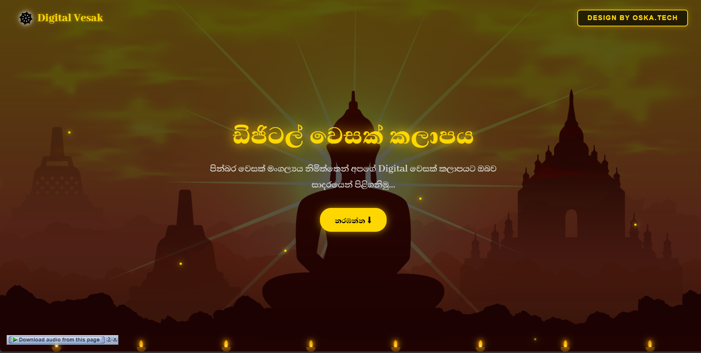

# 🌸 Digital Vesak Zone | ඩිජිටල් වෙසක් කලාපය 🪔

  
  
  

  

## ✨ Welcome to the Virtual Vesak Experience

This project brings the vibrant and spiritual atmosphere of Vesak right to your screens! Featuring 360-degree interactive elements, animations, and traditional background music, it’s a fully immersive digital festival.

### 🌐 Live Demo
👉 **[Click Here to Visit the Digital Vesak Zone](https://digital.vesak.oshadha.live)**

---

## 🚀 Interactive Features / අපගේ අංගයන්

| Feature | Description |
| :--- | :--- |
| **🎆 360° Live Thorana** | Experience a fully immersive 360-degree virtual Thorana using WebVR technology. |
| **🏮 Virtual Vesak Kudu** | Beautifully illuminated digital Vesak lanterns with glowing ambient effects. |
| **🪔 CSS Digital Pahana** | A fully functional, 100% Pure CSS interactive clay lamp. Click to light the flame! |
| **✨ Live Effects** | Animated fireflies (ආලෝක බිංදු) and a spinning Dharmachakra (ධර්ම චක්‍රය). |
| **🎵 Immersive Audio** | Each page features unique, traditional background music. |

---

## 🛠️ Technologies & Tools

This project is built ensuring fast load times and ultra-smooth performance:

* `< HTML5 >` & WebVR integration (A-Frame)
* `{ CSS3 }` Advanced animations, glowing effects, and pure CSS shapes
* `[ Vanilla JS ]` DOM manipulation and media handling
* `A` **Abhaya Libre** Sinhala Typography

---

## 👨‍💻 Developed By

  <b>DESIGN BY OSKA.TECH</b>  
  <i>Bringing tradition to the digital world.</i>

  Feel free to explore, get inspired, and celebrate Vesak digitally!  
  <b>May all beings be happy and peaceful. 🙏</b>

